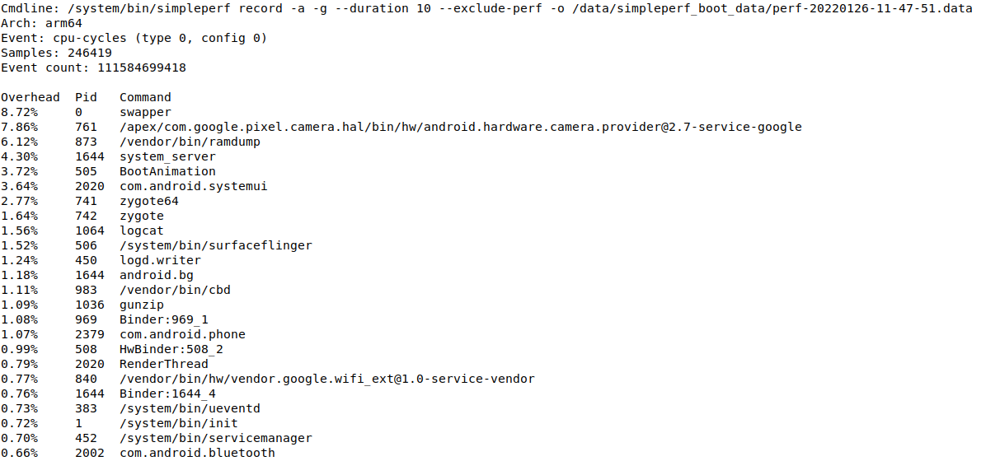

# Android platform profiling

[TOC]

## General Tips

Here are some tips for Android platform developers, who build and flash system images on rooted
devices:
1. After running `adb root`, simpleperf can be used to profile any process or system wide.
2. It is recommended to use the latest simpleperf available in AOSP main, if you are not working
on the current main branch. Scripts are in `system/extras/simpleperf/scripts`, binaries are in
`system/extras/simpleperf/scripts/bin/android`.
3. It is recommended to use `app_profiler.py` for recording, and `report_html.py` for reporting.
Below is an example.

```sh
# Record surfaceflinger process for 10 seconds with dwarf based call graph. More examples are in
# scripts reference in the doc.
$ ./app_profiler.py -np surfaceflinger -r "-g --duration 10"

# Generate html report.
$ ./report_html.py
```

4. Since Android >= O has symbols for system libraries on device, we don't need to use unstripped
binaries in `$ANDROID_PRODUCT_OUT/symbols` to report call graphs. However, they are needed to add
source code and disassembly (with line numbers) in the report. Below is an example.

```sh
# Doing recording with app_profiler.py or simpleperf on device, and generates perf.data on host.
$ ./app_profiler.py -np surfaceflinger -r "--call-graph fp --duration 10"

# Collect unstripped binaries from $ANDROID_PRODUCT_OUT/symbols to binary_cache/.
$ ./binary_cache_builder.py -lib $ANDROID_PRODUCT_OUT/symbols

# Report source code and disassembly. Disassembling all binaries is slow, so it's better to add
# --binary_filter option to only disassemble selected binaries.
$ ./report_html.py --add_source_code --source_dirs $ANDROID_BUILD_TOP --add_disassembly \
  --binary_filter surfaceflinger.so
```

## Start simpleperf from system_server process

Sometimes we want to profile a process/system-wide when a special situation happens. In this case,
we can add code starting simpleperf at the point where the situation is detected.

1. Disable selinux by `adb shell setenforce 0`. Because selinux only allows simpleperf running
   in shell or debuggable/profileable apps.

2. Add below code at the point where the special situation is detected.

```java
try {
  // for capability check
  Os.prctl(OsConstants.PR_CAP_AMBIENT, OsConstants.PR_CAP_AMBIENT_RAISE,
           OsConstants.CAP_SYS_PTRACE, 0, 0);
  // Write to /data instead of /data/local/tmp. Because /data can be written by system user.
  Runtime.getRuntime().exec("/system/bin/simpleperf record -g -p " + String.valueOf(Process.myPid())
            + " -o /data/perf.data --duration 30 --log-to-android-buffer --log verbose");
} catch (Exception e) {
  Slog.e(TAG, "error while running simpleperf");
  e.printStackTrace();
}
```

## Hardware PMU counter limit

When monitoring instruction and cache related perf events (in hw/cache/raw/pmu category of list cmd),
these events are mapped to PMU counters on each cpu core. But each core only has a limited number
of PMU counters. If number of events > number of PMU counters, then the counters are multiplexed
among events, which probably isn't what we want. We can use `simpleperf stat --print-hw-counter` to
show hardware counters (per core) available on the device.

On Pixel devices, the number of PMU counters on each core is usually 7, of which 4 of them are used
by the kernel to monitor memory latency. So only 3 counters are available. It's fine to monitor up
to 3 PMU events at the same time. To monitor more than 3 events, the `--use-devfreq-counters` option
can be used to borrow from the counters used by the kernel.

## Get boot-time profile

On userdebug/eng devices, we can get boot-time profile via simpleperf.

Step 1. In adb root, set options used to record boot-time profile. Simpleperf stores the options in
a persist property `persist.simpleperf.boot_record`.

```
# simpleperf boot-record --enable "-a -g --duration 10 --exclude-perf"
```

Step 2. Reboot the device. When booting, init finds that the persist property is set, so it forks
a background process to run simpleperf to record boot-time profile.

```
$ adb reboot
```

Step 3. After boot, the boot-time profile is stored in /data/simpleperf_boot_data. Then we can pull
the profile to host to report.

```
$ adb shell ls /data/simpleperf_boot_data
perf-20220126-11-47-51.data
```

Following is a boot-time profile example. From timestamp, the first sample is generated at about
4.5s after booting. So simpleperf can record boot-time profile starting from about 4.5s after booting.


